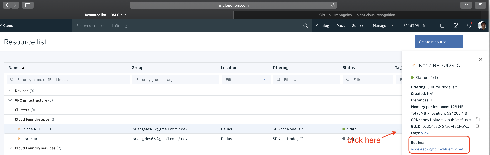
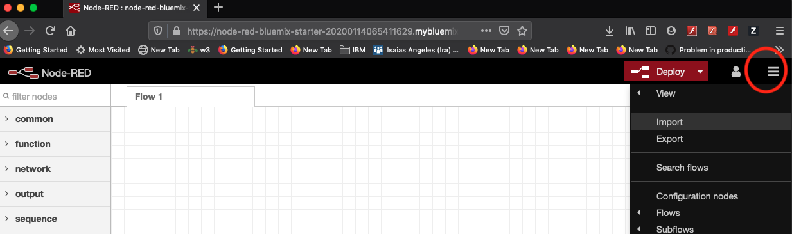
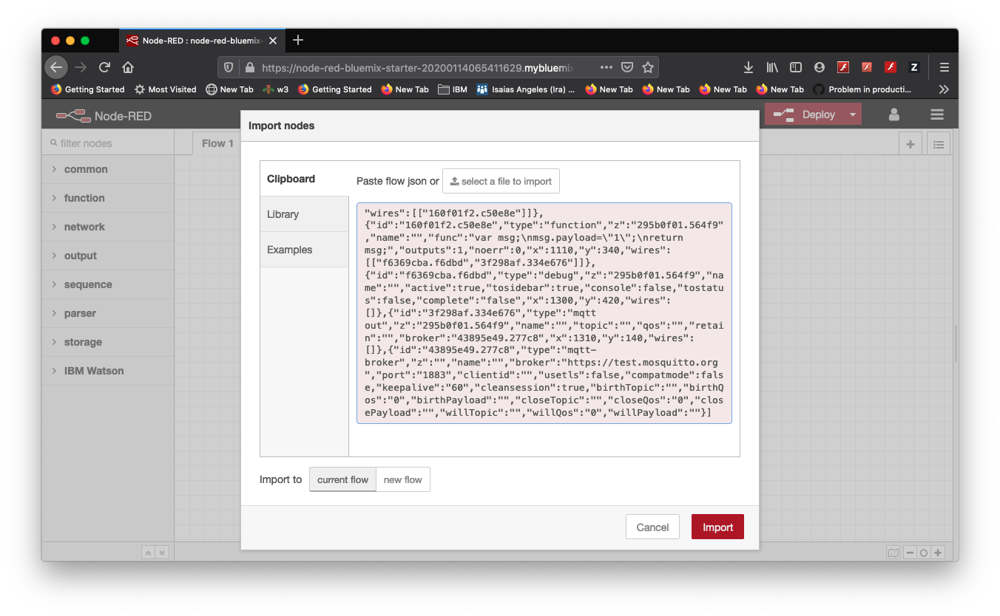
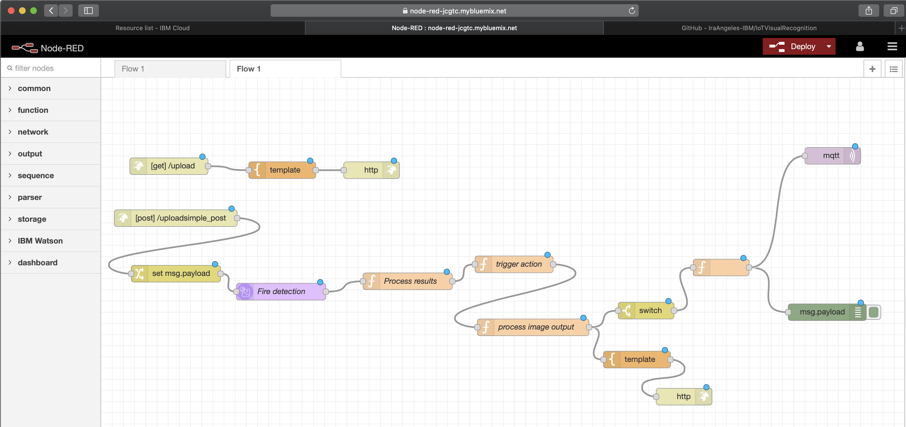

# Importing Node-RED flow

1. Open in browser or download [flows.json](https://github.com/IraAngeles-IBM/IoTVisualRecognition)

 

2. Get the url (Routes) to open the Node-RED application 

 

3. Go to Node-RED Menu and Import option

 

4. Copy the [flows.json](https://github.com/IraAngeles-IBM/IoTVisualRecognition) contents to the import box and click on Import button

 

5. The following is shown upon successful import

 